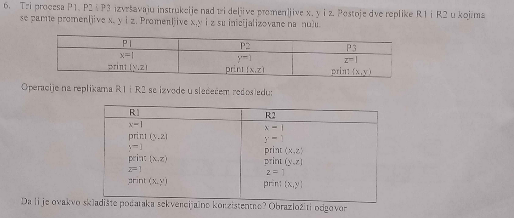

# Jun 2024 - Teorija

1. ***Sta predstavlja skalabilnost DS? Navesti i objasniti tehnike skaliranja.***

- Skalabilnost predstavlja osobinu distribuiranog sistema da nastavi sa funkcionisanjem i odrzi uobicajen nivo performansi uprkos porastu broja klijenata, povecanju geografske udaljenosti klijenata (i servera) i broju administrativnih zona kroz koje se proteze.
- Uobicajene tehnike skaliranja:
  - sakrivanje komunikacionog kasnjenja,
    - koriscenjem asinhronih komunikacija (umesto sinhronih) - klijent ne ceka da dobije odgovor od servera (ne blokira se), vec nastavlja sa radom (radi neki drugi posao) odmah nakon poziva udaljene procedure; kada stigne odgovor servera generise se prekid, cime je trazeni zahtev opsluzen;
    - download-ovanjem dela serverskog koda na klijentsku stranu - npr. provera validnosti forme (pre slanja upita ka bazi) na klijentskoj umesto na serverskoj strani (na ovaj nacin klijent ce poslati samo jednu konacnu poruku - upit - ka serveru, umesto da salje poruku na svaki korisnikov unos); ovaj pristup se cesto koristi kod interaktivnih aplikacija, kod kojih je potrebno da korisnicki interfejs bude sto responsivniji;

2. ***Sta se podrazumeva pod transparentnoscu konkurencije?***

- procesi mogu pristupati resursima bez medjusobne interferencije. (odgovor b)

3. 
   - ***(a) Izlaz iz SUN IDL kompajlera sastoji se od vise fajlova. Koji su to fajlovi i sta sadrze? Napisati nacin na koji se vrsi generisanje ovih fajlova i kako se na osnovu ovih fajlova kreiraju izvrsna klijentska i serverska aplikacija. Za svaki korak napisati odgovarajucu komandu.***
   - ***(b) Koja semantika poziva udaljenih procedura je podrzana kod DCE RPC-a i kako?***

*Odgovor (a)*

- Izlaz iz SUN IDL kompajlera sastoji se od vise fajlova - to su header (`*.h`, odnosno konkretnije `primer.h`) fajl, klijent stub (`*_clnt.c`, odnosno konkretnije `primer_clnt.h`) fajl i server stub (`*_svc.c`, odnosno konkretnije `primer_svc.h`) fajl; 
  - u header fajlu se nalaze deklarisane konstante i korisnicki tipovi (deklarisu se u prvom delu pomenute XDR specifikacije), kao i broj programa, broj verzije i prototipi procedura (funkcija); on treba da bude ukljucen u klijent i server kod (koje pise programer);
  - u klijent stub fajlu nalaze se procedure koje ce klijentski program pozivati; ove procedure zaduzene su za pakovanje argumenata u poruke (marshalling), slanje poruka, prijem poruka, raspakivanje (unmarshalling) rezultata i prosledjivanje klijentskom programu;
  - u server stub fajlu nalaze se procedure koje se pozivaju kada poruka stigne do servera i koje zatim pozivaju odgovarajucu serversku proceduru;

- Nacin na koji se vrsi generisanje ovih fajlova - komandom `$ rpcgen -C primer.x`; `primer.x` predstavlja Sun RPC IDL specifikaciju, odnosno XDR (eXternal Data Representation) specifikaciju;

- Koraci u kreiranje izvrsnih fajlova jednog Sun RPC programa (pogledaj primere na [link](https://web.cs.wpi.edu/~rek/DCS/D04/SunRPC.html)-u):
  1. Kreiranje XDR specifikacije (`primer.x` fajl);
  2. Komanda `$ rpcgen -C primer.x` za kompajliranje specifikacije - izlaz su `primer.h`, `primer_svc.c` i `primer_clnt.c`;
  3. Implementacija klijentske strane - klijentski kod u okviru `main` funkcije (u okviru recimo `client.c` fajla), uz obavezno ukljucen `primer.h`; na klijentu se treba implementirati:
     1. povezivanje sa serverom - pre poziva bilo koje udaljene procedure (bind-ovanje) - vrsi se pozivom funkcije `clnt_create` (`CLIENT *p_clnt = clnt_create(<adresa_servera:string>, <BROJ_PROGRAMA:konstanta>, <VERZIJA_PROGRAMA:konstanta>, ["udp" | "tcp"])`);
     2. klijentska logika - u ovom delu ce biti pozivane udaljene procedure, a pozivaju se kao `rezultati = <ime_procedure>_<broj_verzije>(&operandi, p_clnt);` (`operandi` i `rezultati` su strukturni tipovi definisani jos u okviru XDR specifikacije);
  4. Kompajliranje i linkovanje klijentske strane - `$ cc -o client client.c primer_clnt.c`;
  5. Implementacija serverske strane - nakon izvrsenja komande `$ rpcgen -C -Ss primer.x > server.c` generisace se `server.c` fajl sa praznim procedurama cija imena prate sledeci nacin imenovanja - `<ime_procedure>_<broj_verzije>_svc`; prvi argument je pokazivac na operande, a drugi strukturni tip `struct svc_req`, koji sadrzi razne informacije o klijentskom pozivu;
  6. Kompajliranje i linkovanje serverske strane - `$ cc -o server server.c primer_svc.c`;
  7. Izvrsenje - `$ ./server` i `$ ./client [<args>]`;

*Odgovor (b)*

- DCE RPC podrzava 2 semantike poziva udaljenih procedura:
  - "bar jednom" - kod idempotentnih procedura, moraju se oznaciti kao `idempotent` u IDL specifikaciji (`*.idl`);
  - "samo jednom" - procedura nije idempotentna; ovo je uobicajeno ponasanje;

4. 
   1. ***(a) Navesti kriterijume za podelu komunikacija u distribuiranim sistemima. Koji su sve tipovi komunikacija u distribuiranom sistemu su podrzani od strane MPI i kojim funkcijama? Obrazloziti izvrsenje svake funkcije.***
   2. ***(b) Sta je JMS administrativni objekat, koja je njegova uloga, i koji su primeri takvih objekata? Iz cega se sastoji JMS poruka i kako i na osnovu cega se mogu filtrirati JMS poruke?***

*Odgovor (a)*

- Kriterijumi za podelu komunikacija u distribuiranim sistemima:
  - sinhronizacija - postoje sinhrone (blokirajuce) i asinhrone (neblokirajuce) komunikacije;
  - postojanost - perzistentne i tranzijentne;
  - vremenska zavisnost - diskretne i stream-ovane;

- Tipovi komunikacija podrzani od strane MPI:
  - `MPI_Bsend` - poziv se blokira dok poruka nije iskopirana u lokalni bafer (varijanta c);
  - `MPI_Send` - poziv se blokira dok poruka nije iskopirana u bafer odredisnog hosta (varijanta d);
  - `MPI_Ssend` - poziv se blokira dok ne krene prijem poruke (varijanta f);
  - `MPI_Sendrecv` - poziv se blokira dok ne stigne odgovor iz odredista (varijanta e);
  - `MPI_Isend` - prosledi referencu na poruku i nastavi sa izvrsenjem;
  - `MPI_Issend` - prosledi referencu na poruku i blokiraj se dok ne krene prijem;
  - `MPI_Recv` - poziv se blokira dok ne stigne poruka;
  - `MPI_Irecv` - prijemnik je spreman da prihvati poruku;

*Odgovor (b)*

- JMS administrativni objekti su unapred kreirani objekti od strane administratora za upotrebu od strane klijenta; oni su unapred konfigurisani i upravljani od strane administranora, umesto da se dinamicki kreiraju od strane koda aplikacije; sluze kao 'most' izmedju koda klijenta i JMS provajdera; primeri takvih objekata su JMS fabrike konekcija (`QueueConnectionFactory`, `TopicConnectionFactory`) i JMS destinacije (`Topic`, `Queue`).
- JMS poruka sastoji se iz 3 dela:
  - zaglavlja - sadrzi sve informacije potrebne za identifikaciju i rutiranje poruke, uglavnom utistune od strane JMS provajdera;
  - skupa korisnicki definisanih svojstava (property-a);
  - tela poruke, koje moze biti razlicitog tipa - `TextMessage`, `ByteMessage`, `StreamMessage`, `MapMessage`, `ObjectMessage`;
- Filtriranje poruka u JMS-u, nakon odabira zeljenog topic-a/queue-a moze se vrsiti pomocu tzv. [message selector](https://stackoverflow.com/questions/38865312/how-to-use-message-selectors-to-filter-messages-in-jms)-a, koji se definisu tokom kreiranja potrosaca poruka, koji predstavljaju uslov nalik na upit koji JMS provajder koristi da vrsi filtriranje na osnovu vrednosti zadatih u zaglavlju/property delu poruke (a ne u okviru tela); naravno, moze se osmisliti i logika na strani klijenta koja zanemaruje pristigle poruke ispitujuci njeno telo; 

1. ***Sta je definicija potpuno uredjene grupne komunikacije?***

- Poruke se isporucuju svim procesima po istom redosledu. (odgovor d)

6. 

| R1 | Out | R2 | Out |
| -- | --- | -- | --- | 
| x = 1 | / | x = 1 | / |
| print(y, z) | 00 | y = 1 | / |
| y = 1 | / | print(x, z) | 10 |
| print(x, z) | 10 | print(y, z) | 10 |
| z = 1 | / | z = 1 | / |
| print(x, y) | 11 | print(x, y) | 11 |
| finally R1: | 001011 | finally R2: | 101011 |

Kao sto se moze videti i iz potpisa - ne vide svi procesi isti redosled operacija, pa ovo skladiste ocigledno nije sekvencijalno konzistentno.

7. ******
   1. ***(a) Koji tipovi gresaka postoje u odnosu na trajanje? Dati primere. Objasniti razliku izmedju mirnih i vizantijskih gresaka.***
   2. ***(b) U grupi postoji 10 repliciranih procesa. Ako mogu nastupiti samo mirne greske, koliko maksimalno procesa moze otkazati a da se ipak dobije korektan rezultat? Koliko u slucaju vizantijskog tipa gresaka? Sta ako nastupe greske vizantijskog tipa, a procesi moraju postici konsenzus?***

*Odgovor (a)*

- U odnosu na trajanje postoje:
  - prolazne - isticanje timeout-a za slanje poruke, nakon retransmisije problem vise ne postoji;
  - periodicne - greska u mreznom kablu, u kome postoji neki prekid;
  - stalne - prestanak rada neke HW komponente sistema (HDD-a ili neceg slicnog);

*Odgovor (b)*

- U grupi od N=10 repliciranih procesa, ako:
  - mogu nastupiti mirne - k+1=N => k=N-1=10-1=9 => 9 procesa moze da otkaze;
  - mogu nastupiti vizantijske - 2k+1=N => k=(N-1)/2=(10-1)/2=4 => 4 procesa moze da otkaze;
  - mogu nastupiti vizantijske i potrebno je postici konsenzus - 3m+1=N => m=(N-1)/3=9/3=3 => 3 procesa moze da otkaze;  

8. 
   - ***(a) Tacno/Netacno - DFS***
      1. ***Implementacija klijenta moze biti komplikovanija kod stateful servera***
      2. ***Zakljucavanje fajla je tesko implementirati kod stateless servera.***
      3. ***Kod stateful servera svaki klijentski zahtev mora da sadrzi sve informacije o zahtevu.***
      4. ***Lakse je izboriti se sa greskama kod stateless nego kod stateful servera.***
    2. ***(b) Navesti sve daemone u Hadoop klasteru, objasniti njihove uloge, kao i gde se izvrsavaju u okviru klastera. Sta predstavlja blok i koje su prednosti kod koriscenja blokova kod HDFS-a? Pretpostavimo da je fajl velicine 514MB sacuvan u HDFS-u. Ako je velicina bloka 64MB i podrazumevani faktor replikacije 4, koliki je ukupan broj blokova i kolika je velicina svakog od njih?***

*Odgovor (a)*

- False (stateful server podrazumeva preuzimanje vece kompleksnosti na serverskoj strani);
- True (stateless servisi ne pamte nikakve informacije o pristupu fajlovima, pa je za ovako nesto moguce jedino implementirati distribuirani algoritam na klijentskoj strani, sto jako povecava kompleksnost);
- False (stateful servis pamti informacije o klijentima i pristupima, pa se klijent moze 'nadovezati' na svoj prethodni zahtev, tj. na neki nacin formirati sesiju sa serverom - stateful konekcija);
- True (ukoliko se desi greska kod stateful servera, potrebno je pribeci nekom od metoda razresenja - backward/forward recovery - dok je kod stateless servera potreban samo reboot, on nastavlja da radi sasvim normalno pri ponovnom podizanju, zato sto ne pamti nikakve informacije, pa je nepotrebno restaurirati ih);

*Odgovor (b)*

- Hadoop daemoni:
  - HDFS daemoni:
    - NameNode - vodjenje racuna o metapodacima sistema, upravljanje replikacijom, upravljanje procesom upisa/citanja podataka (blokova) iz HDFS-a, upravljanje Hadoop job-ovima;
    - DataNode - cuvanje blokova, slanje informacija o sacuvanim blokovima NameNode-u;
    - Secondary NameNode - periodicni checkpoint-i, da bi se smanjio edit log i update-ovao fsimage, kako ne bi doslo do predugog podizanja sistema pri reboot-ovanju;
  - MapReduce daemoni - staraju se o izvrsenju Hadoop job-ova;

- Blok je osnovna forma u kojoj se cuvaju podaci u okviru Hadoop-ovog fajl sistema. Svi fajlovi koji se cuvaju u okviru HDFS-a se prvo dele na odredjeni broj blokova (svi blokovi imaju fiksni velicinu, kod starijih Hadoop verzija 64MB, kod novijih 128B; zbog ovoga moze doci do unutrasnje fragmentacije), a zatim bivaju replicirani i upisani. Prednosti su - zbog fiksne velicine, zna se koliko blokova moze stati na odredjeni disk, zbog podele na blokove fajl moze biti veci nego bilo koji pojedinacni disk u okviru sistema, zbog lake replikacije, imaju visok stepen otpornosti na greske (FT - Fault Tolerance);

> [!IMPORTANT]
> Kratko razmisljanje - blokovi u Hadoop sistemu nekako imaju slicne prednosti kao stranica virtuelne memorije ([virtual memory page](https://en.wikipedia.org/wiki/Page_%28computer_memory%29)).