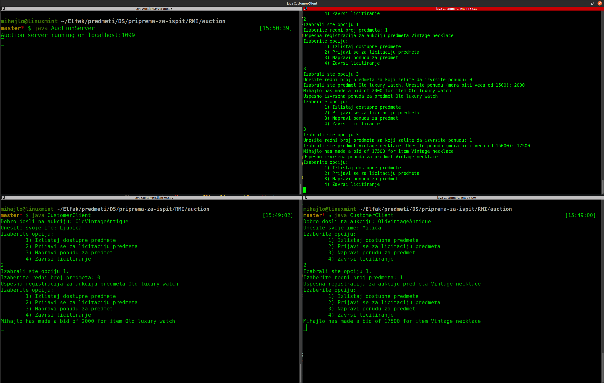

# Java RMI

## Sta je najbitnije

- Za implementaciju svakog _remote_ objekta, odnosno kreiranje tipa/klase _remote_ objekata potrebno je znati par stvari:
  - potrebno je prvobitno kreirati njegov interfejs (`interface`), koji ce biti izveden iz `java.rmi.Remote` (`extends Remote`) klase;
    - svaki metod u okviru ovog interfejsa treba da bude deklarisan tako da moze da baci `java.rmi.RemoteException` (odnosno `throws Remote`);
    - dobra _naming_ konvencija je stavljanje prefiksa `I` na ime datih interfejsa (npr. `IMojaRemoteKlasa`, `IStudent`, `IAkumulator`, ...);
  - zatim, potrebno je kreirati konkretnu klasu koja ce biti izvedena iz `java.rmi.server.UnicastRemoteObject` i istovremeno implementirati prethodno kreirani interfejs, tj. `extends java.rmi.server.UnicastRemoteObject implements <ime_interfejsa>`;
    - u ovoj klasi mora da postoji konstruktor, makar i praznog tela, koji ce bacati `java.rmi.RemoteException`;
  - ovaj postupak se ponavlja za sve domenske klase;
  - nakon implementacije kompletne domenske logike problema, treba napisati server i klijent - klase koje ce sadrzati `main` metodu i koje sluze kao _entrypoint_ u nasu aplikaciju;
    - u serveru ce zapravo "ziveti" nasi _remote_ objekti (ne racunajuci `Serializable` objekte, oni se zapravo salju kroz mrezu), koji ce biti mapirani u okviru RMI _registry_ servisa (ovo je samo jos jedan servis koji omogucava ispravno funkcionisanje RMI _middleware_-a);
      - kreiranje _registry_ servisa vrsi se pomocu komande `java.rmi.registry.LocateRegistry.createRegistry(<broj_porta>)` (`<broj_porta>` je najcesce `1099`) - vrsice mapiranje [URI](https://en.wikipedia.org/wiki/Uniform_Resource_Identifier)-ja (preko _rmi_ protokola) na nase _remote_ objekte, preko koga mozemo da im pristupimo kroz mrezu;
      - zapravo mapiranje objekta u _registry_-ju vrsi se pomocu komande `java.rmi.Naming.rebind("rmi://localhost:1099/<ime_objekta>", objekat);`;
      - server ce dakle samo sluziti da na njemu "zive" nasi _remote_ objekti i njihovo mapiranje na konkretne URI-eve pomocu _registry_ servisa;
    - klijentska strana bice logicki kompleksnija (zavisno od domenskog problema), a jedini bitan poziv vezan za RMI bice `java.rmi.Naming.lookup("rmi://localhost:1099/<ime_objekta>")` - pribavljanje reference na _remote_ objekat, preko koje mozemo pristupati njegovim metodama (ovo je upravo ono sto nazivamo RMI - _Remote Method Invocation_), i pribavljati reference, koje se nalaze u njemu, na druge _remote_ objekte;

> Napomena - ukoliko u okviru nasih _remote_ objekata imamo neke [DTO](https://stackoverflow.com/questions/1051182/what-is-a-data-transfer-object-dto) objekte, tj. objekte koji sadrze vrednosti podataka od kojih su sacinjeni, a ne reference na njih (to ce uglavnom biti klase koje se sastoje samo od _built-in_ atributa), mozemo implementirati, umesto interfejsa `java.rmi.Remote`, interfejs `java.io.Serializable`;

---

## Primeri

### Prosti aukcioni sistem

- Kupac (klijent) moze da izlista sve proizvode za koje je moguce dati ponudu.
- Kupac moze da se prijavi da ucestvuje na aukciji za neki proizvod, odnosno ovo mora da uradi ukoliko zeli da licitira za njega.
- Kupac moze da izvrsi licitaciju ukoliko je prijavljen - u ovom trenutku se svim kupcima koji su se prijavili za licitiranje za dati proizvod salje poruka o novoj ceni.
- Za svaki proizvod se moze izvrsiti `N` licitacija. Nakon toga, proizvod se prodaje kupcu koji je ponudio najvise. Samo ovaj kupac se obavestava o tome, kao i ceni za koju je kupio proizvod.

- Kod se moze pronaci [ovde](./auction/).
- Izgled konzole pri izvrsenju:

### 4. Zadatak sa lab vezbi - Prijava ispita

> Obrada izuzetaka nije bas najbolja u prethodnom primeru i kod je generalno pisan ad-hoc. Zbog toga ostavljam i jedan [primer sa lab vezbi](./prijava_ispita/L01Z04%20Prijava%20Ispita.pdf) sa nadogradnjom callback-a. Nadogradnja ce biti sledeca: svaki klijent moze pratiti, odnosno prekinuti pracenje prijava jednog ili vise studenata. Ukoliko klijent prati studenta _X_ i za njega bude dodata prijava, klijent ce dobiti vest o tome.

- Kod se moze pronaci [ovde](./prijava_ispita/).
- Izgled konzole pri izvrsenju:

---

[Povratak na pocetnu stranicu](../README.md)